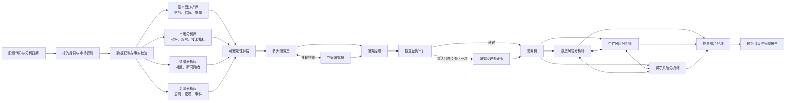
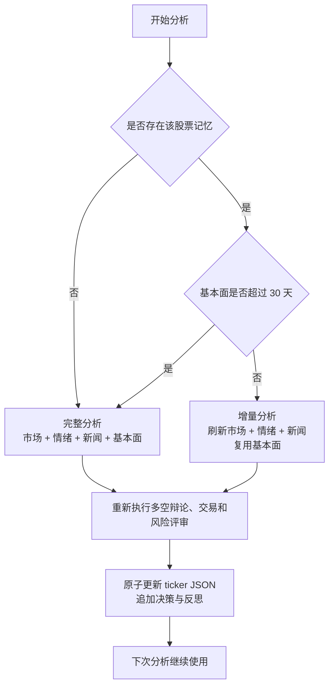
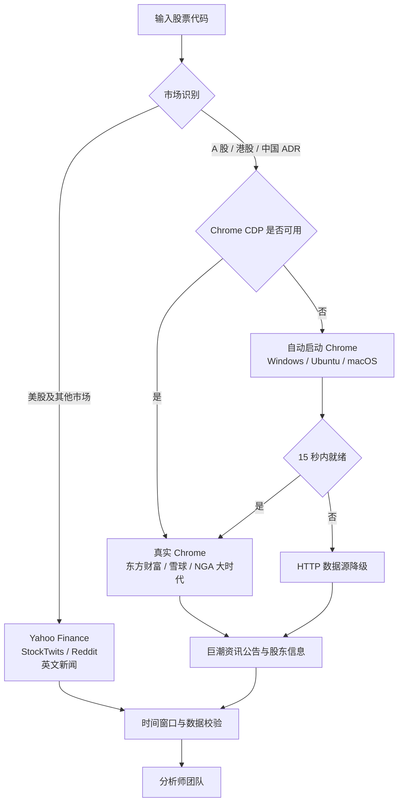

# FxxKStock 中文增强版

一个面向中国市场使用场景深度改造的多智能体证券研究系统。

本项目基于开源项目 [TauricResearch/TradingAgents](https://github.com/TauricResearch/TradingAgents) 进行二次开发。目前是个人维护的初版，保留了原项目基于 LangGraph 的多智能体协作框架，并围绕中文研究、A 股/港股数据、可视化工作台、长期记忆和本地 Chrome 数据采集进行了较大范围的重构。

> 本项目用于技术研究和辅助分析，不构成投资建议。模型输出、网络数据和历史表现均可能存在错误，请勿将结果直接用于真实交易决策。

## 项目定位

传统的单轮大模型分析容易出现上下文割裂、事实缺少验证、重复抓取数据和结论不可追踪等问题。本项目将证券研究拆分为多个职责明确的智能体，让它们围绕同一份市场数据分别分析、相互辩论，并由风险团队和投资组合经理形成最终意见。

当前版本重点解决以下问题：

- 面向 A 股、港股和中国 ADR 自动切换中文数据源。
- 对关键行情数据进行确定性校验，减少价格和标的身份幻觉。
- 为每只股票保存独立记忆，后续分析在历史结论上增量更新。
- 提供实时 Web 工作台，展示 Agent 执行阶段、工具调用和最终报告。
- 自动启动并复用本地 Google Chrome，通过 CDP 获取动态网页数据。
- 支持多家云端模型、本地模型和 OpenAI-compatible 服务。

## 核心能力

| 能力 | 说明 |
|---|---|
| 多智能体协作 | 市场、情绪、新闻、基本面、研究、交易和风险智能体分工协作 |
| 多空辩论 | Bull 与 Bear Researcher 进行多轮论证，由 Research Manager 汇总 |
| 风险评审 | 激进、中性、保守三类风险角色审查交易计划 |
| 结构化反偏见 | 可研究性评级、独立证伪审计、条件性单次修正及三维置信度 |
| 中国市场适配 | 支持 `.SS`、`.SZ`、`.HK` 及常见中国 ADR |
| 中文数据源 | 东方财富、雪球、NGA 大时代、巨潮资讯及中文宏观新闻 |
| 行情事实校验 | 对标的身份、OHLCV、指标日期和数据窗口进行验证 |
| 股票长期记忆 | 保存每只股票的历史报告、最终决策和事后反思 |
| 增量分析 | 默认复用 30 天内的基本面，刷新行情、新闻和情绪 |
| Web 工作台 | 历史报告、实时阶段、运行状态、模型配置和记忆状态 |
| Chrome 自动管理 | Windows、Ubuntu、macOS 自动启动 Google Chrome CDP |
| 多模型支持 | OpenAI、Gemini、Claude、DeepSeek、Qwen、GLM、MiniMax、Ollama 等 |
| 故障恢复 | 可选 LangGraph SQLite checkpoint，支持中断后恢复 |

## 智能体工作流程



### 各团队职责

1. **分析师团队**
   - 市场分析师：价格走势、成交量、技术指标和关键价位。
   - 情绪分析师：新闻、StockTwits、Reddit 或中文社区情绪。
   - 新闻分析师：公司新闻、宏观数据、预测市场和重大事件。
   - 基本面分析师：财务报表、盈利质量、资产负债和估值。
2. **研究团队**
   - 多头和空头研究员基于相同材料提出相反观点。
   - 研究经理提炼争议点并形成投资研究结论。
3. **交易与风险团队**
   - 交易员将研究结论转化为仓位和交易计划。
   - 三类风险分析师从不同风险偏好审查方案。
   - 投资组合经理输出最终 Buy、Overweight、Hold、Underweight 或 Sell。

## 按股票持久化记忆

每只股票都有独立记忆文件：

```text
memory/
├── trading_memory.md
└── tickers/
    ├── 513100.SS.json
    └── 600353.SS.json
```

首次分析执行完整流程。后续分析默认进入增量模式：



记忆内容包括：

- 最近分析日期和累计分析次数。
- 市场、情绪、新闻、基本面四类报告。
- 最近一次最终决策。
- 基本面数据日期和更新时间。
- 历史决策的实际收益、相对基准收益和反思。

Web 中可选择：

- `Auto Incremental`：自动复用有效记忆。
- `Full Refresh`：强制重新运行全部分析师，但仍向 Agent 提供历史上下文。

`memory/` 属于本地运行数据，默认不会提交到 Git。

## 中国市场数据流程

系统会根据交易所后缀、标的元数据和 ADR 列表识别市场区域。



中国市场默认数据策略：

| 数据类型 | 默认/海外市场 | 中国相关标的 |
|---|---|---|
| 行情与技术指标 | Yahoo Finance | Yahoo Finance + 验证快照 |
| 公司新闻 | Yahoo Finance | Chrome/CDP，失败后东方财富 HTTP |
| 宏观新闻 | 英文新闻与 FRED | 中文宏观新闻与国内数据源 |
| 社区情绪 | StockTwits、Reddit | 东方财富股吧、雪球、NGA 大时代 |
| 官方公告 | 供应商数据 | 巨潮资讯 CNINFO |
| 预测市场 | Polymarket | Polymarket，失败时降级 |

## Chrome 自动启动

分析中国市场标的前，系统会检查 `http://127.0.0.1:9222/json/version`。如果没有可用 CDP，会根据用户选择自动启动桌面版 Google Chrome。

支持的平台：

- macOS
- Windows
- Ubuntu

Chrome 使用项目专用配置目录：

```text
browser_data/chrome-profile/
```

第一次启动后，可在该 Chrome 窗口登录需要 Cookie 的网站。Chrome 会保持运行，后续分析直接复用。该目录可能包含登录信息，已加入 `.gitignore`，请勿公开或提交。

中文社区情绪默认同时启用东方财富、雪球和 NGA。NGA 数据来自“大时代”
版块（`fid=706`），系统会用证券中文名称搜索个股主题，并在可识别时补充行业主题，
再读取近期主题帖及回复。NGA 和雪球可能要求登录；可在 Web 设置页的“浏览器登录”
区域打开对应网站并登录，登录状态会保存在上述专用 Chrome Profile 中。

如果 Chrome 启动失败，系统不会终止分析，而是自动回退到 HTTP 数据源。

## Web 工作台

Web 端提供：

- 历史报告搜索和决策标签。
- 实时 Agent 阶段时间线。
- 工具调用摘要和数据视图。
- 模型供应商、Quick/Deep Model 和研究深度配置。
- 股票记忆状态与增量/全量模式。
- Chrome 平台、自动启动和 CDP 状态。
- 最终 Markdown 报告查看。

### 启动

```bash
conda activate fxxkstock
cd /path/to/FxxKStock

pip install -e ".[webapp]"
python -m webapp.server
```

访问：

```text
http://localhost:8000
```

也可以使用安装后的命令：

```bash
fxxkstock-web
```

## 快速开始

### 1. 环境要求

- Python 3.10 及以上，推荐 Python 3.12。
- Google Chrome，仅中国市场浏览器数据源需要。
- 至少一个可用的 LLM API Key，或本地 Ollama/OpenAI-compatible 服务。

### 2. 创建环境

```bash
git clone <你的仓库地址>
cd FxxKStock

conda create -n fxxkstock python=3.12
conda activate fxxkstock
pip install -e ".[webapp]"
```

开发和测试环境：

```bash
pip install -e ".[dev,webapp]"
```

### 3. 配置模型

```bash
cp .env.example .env
```

在 `.env` 中填写所使用供应商的 Key，例如：

```bash
DEEPSEEK_API_KEY=your-key
FXXKSTOCK_LLM_PROVIDER=deepseek
FXXKSTOCK_QUICK_THINK_LLM=deepseek-v4-flash
FXXKSTOCK_DEEP_THINK_LLM=deepseek-v4-pro
FXXKSTOCK_OUTPUT_LANGUAGE=Chinese
```

支持的主要环境变量：

| 环境变量 | 用途 |
|---|---|
| `OPENAI_API_KEY` | OpenAI |
| `GOOGLE_API_KEY` | Gemini |
| `ANTHROPIC_API_KEY` | Claude |
| `DEEPSEEK_API_KEY` | DeepSeek |
| `DASHSCOPE_API_KEY` / `DASHSCOPE_CN_API_KEY` | Qwen |
| `ZHIPU_API_KEY` / `ZHIPU_CN_API_KEY` | GLM |
| `MINIMAX_API_KEY` / `MINIMAX_CN_API_KEY` | MiniMax |
| `OPENROUTER_API_KEY` | OpenRouter |
| `FRED_API_KEY` | FRED 宏观数据 |
| `FXXKSTOCK_LLM_PROVIDER` | 默认模型供应商 |
| `FXXKSTOCK_LLM_BACKEND_URL` | 自定义兼容接口地址 |
| `FXXKSTOCK_OUTPUT_LANGUAGE` | 报告语言 |
| `FXXKSTOCK_CHROME_PLATFORM` | `macos`、`windows` 或 `ubuntu` |
| `FXXKSTOCK_CHROME_AUTO_START` | 是否自动启动 Chrome |
| `FXXKSTOCK_CHROME_EXECUTABLE` | 自定义 Chrome 可执行文件 |
| `FXXKSTOCK_CHROME_PROFILE_DIR` | 自定义 Chrome Profile 路径 |

### 4. 启动 CLI

```bash
fxxkstock
```

或直接从源码运行：

```bash
python -m cli.main
```

CLI 会依次询问股票代码、分析日期、Chrome 平台、报告语言、分析师、研究深度、模型供应商和模型。

### 5. 直接运行

```bash
python main.py 600519.SS 2026-06-28
```

报告默认保存在：

```text
reports/<TICKER>_<YYYYMMDD_HHMMSS>/
```

## Python 调用

```python
from fxxkstock.default_config import DEFAULT_CONFIG
from fxxkstock.graph.fxxkstock_graph import FxxKStockGraph

config = DEFAULT_CONFIG.copy()
config["llm_provider"] = "deepseek"
config["quick_think_llm"] = "deepseek-v4-flash"
config["deep_think_llm"] = "deepseek-v4-pro"
config["output_language"] = "Chinese"
config["cn_browser_platform"] = "macos"

graph = FxxKStockGraph(config=config, debug=True)

final_state, decision = graph.propagate(
    "600519.SS",
    "2026-06-28",
    analysis_mode="auto",
)

print(decision)
```

强制完整刷新：

```python
final_state, decision = graph.propagate(
    "600519.SS",
    "2026-06-28",
    analysis_mode="full",
)
```

## 数据持久化与恢复

| 目录 | 内容 |
|---|---|
| `reports/` | 每次运行生成的完整 Markdown 报告 |
| `memory/tickers/` | 每只股票的最新结构化记忆 |
| `memory/trading_memory.md` | 决策、实际收益和反思日志 |
| `browser_data/chrome-profile/` | 自动启动 Chrome 的专用配置 |
| `~/.fxxkstock/cache/checkpoints/` | 可选的 LangGraph 中断恢复数据 |

启用 checkpoint：

```bash
fxxkstock analyze --checkpoint
```

程序调用：

```python
config["checkpoint_enabled"] = True
```

checkpoint 用于未完成任务的崩溃恢复；ticker memory 用于不同运行之间的长期分析记忆，两者用途不同。

## 项目结构

```text
FxxKStock/
├── cli/                         # 终端交互界面
├── webapp/                      # FastAPI 服务与 Web 工作台
├── fxxkstock/
│   ├── agents/                  # 分析、研究、交易和风险智能体
│   ├── dataflows/               # 行情、新闻、社区和浏览器数据源
│   ├── graph/                   # LangGraph 工作流与运行生命周期
│   ├── llm_clients/             # 模型供应商适配
│   ├── default_config.py        # 默认配置
│   └── reporting.py             # 报告输出
├── tests/                       # 单元与集成测试
├── reports/                     # 本地报告，不提交 Git
├── memory/                      # 本地股票记忆，不提交 Git
└── browser_data/                # 本地 Chrome Profile，不提交 Git
```

## 测试

安装开发依赖：

```bash
pip install -e ".[dev,webapp]"
```

运行全部测试：

```bash
pytest -q
```

运行关键模块：

```bash
pytest -q tests/test_webapp.py
pytest -q tests/test_ticker_memory.py
pytest -q tests/test_chrome_manager.py
pytest -q tests/test_playwright_web.py
```

涉及真实模型、网络数据或 Chrome 的测试可能需要 API Key、网络和本地浏览器环境。

### 数据源诊断

不运行智能体，仅检查 Chrome CDP、东方财富股吧、雪球、NGA 大时代、
东方财富新闻和 Polymarket：

```bash
python scripts/diagnose_data_sources.py --ticker 159516.SZ --platform macos
```

浏览器加载成功的原始 HTML 会保存到
`logs/source_diagnostics/<timestamp>/`，便于检查页面结构和调整解析器。
东方财富宏观关键词会同时测试浏览器与 HTTP 两条路径。

只诊断 NGA（建议首次使用时先在专用 Chrome 中登录）：

```bash
python scripts/diagnose_data_sources.py \
  --ticker 300308.SZ \
  --platform macos \
  --only-nga
```

如证券名称无法自动解析，或需要指定行业关键词：

```bash
python scripts/diagnose_data_sources.py \
  --ticker 300308.SZ \
  --platform macos \
  --only-nga \
  --nga-query 中际旭创 \
  --nga-industry 光模块 \
  --keep-nga-open
```

NGA 诊断结果会额外保存搜索页、抽样主题页和结构化回复到
`logs/source_diagnostics/<timestamp>/`。`--keep-nga-open` 会保留相关标签页，
方便人工核对搜索结果。

只测试 HTTP 数据源：

```bash
python scripts/diagnose_data_sources.py --ticker 159516.SZ --no-browser
```

输出 JSON：

```bash
python scripts/diagnose_data_sources.py --ticker 159516.SZ --json
```

## 当前阶段

这是在原始 TradingAgents 基础上进行大规模改造后的 FxxKStock 初版，当前目标是建立一套可实际使用、可持续积累股票研究记忆的中文多智能体分析工作台。

已经完成的主要改造：

- 中国市场数据路由，以及东方财富、雪球、NGA 大时代中文社区数据源。
- 标的身份、行情窗口和关键价格校验。
- 结构化模型输出和五级投资评级。
- Web 实时工作台与历史报告。
- 每只股票独立的持久化记忆和增量分析。
- Windows、Ubuntu、macOS Chrome 自动启动。
- 多供应商模型注册和配置。
- FRED、Polymarket、CNINFO 等扩展数据源。

当前仍建议重点验证：

- 不同市场和数据供应商的长期稳定性。
- 长时间运行和并发任务下的资源管理。
- 各模型结构化输出的一致性。
- 记忆压缩、历史版本和回测评估。
- Windows、Ubuntu、macOS 的真实 Chrome 集成。

## 与上游项目的关系

本项目是 [TradingAgents](https://github.com/TauricResearch/TradingAgents) 的衍生版本，不代表上游官方版本。

上游项目提供了多智能体金融研究的核心思想、LangGraph 工作流基础和原始实现。本仓库在此基础上进行了面向个人使用场景的大范围修改。使用或分发本项目时，应继续遵守仓库中的 Apache License 2.0，并保留原项目的版权和归属信息。

原始论文：

```bibtex
@misc{xiao2025tradingagentsmultiagentsllmfinancial,
  title={TradingAgents: Multi-Agents LLM Financial Trading Framework},
  author={Yijia Xiao and Edward Sun and Di Luo and Wei Wang},
  year={2025},
  eprint={2412.20138},
  archivePrefix={arXiv},
  primaryClass={q-fin.TR},
  url={https://arxiv.org/abs/2412.20138}
}
```

## License

本项目沿用 Apache License 2.0。完整条款见 [LICENSE](LICENSE)。
